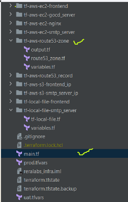
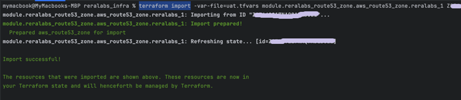
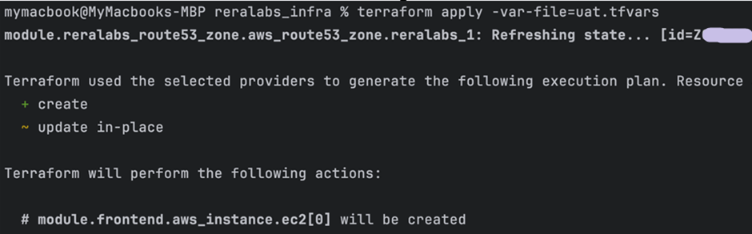
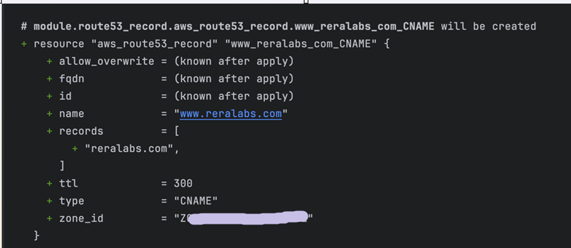

### Introduction

During the initial provisioning of [reralabs.com](https://reralabs.com), a lot of Route-53 entries on AWS were done manually.
This was required for quick feedback loops.

As we gathered user-input and standardize the infrastructure components,
we wanted to organize and manage infrastructure-code using Terraform.

We had to bring the existing infra into the control-plane of Terraform.

#### Example using Route-53 for [reralabs.com](https://reralabs.com)

1. Create a module for Route53 zone

    

2. Perform `terraform import -var-file=uat.tfvars module.<module_name>.aws_route53_zone.<zone_name> Z00XXXX00XX` on the CLI

    

3. Once `import` is successful, the new module will become in-scope.

   

4. We can now `add/modify` Route53 records using terraform

    

